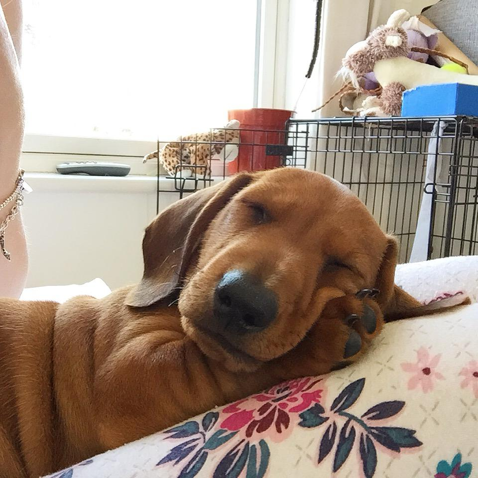
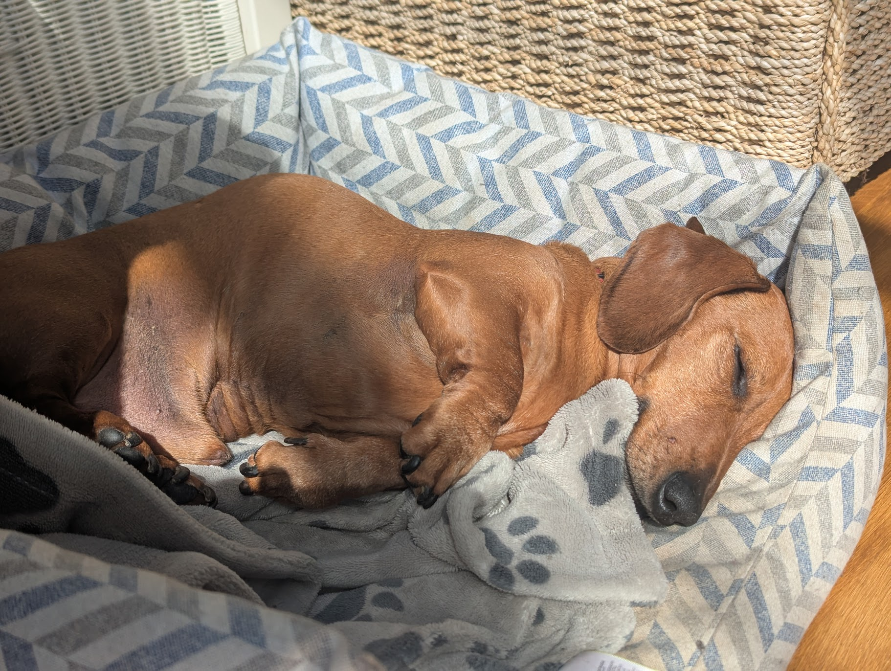
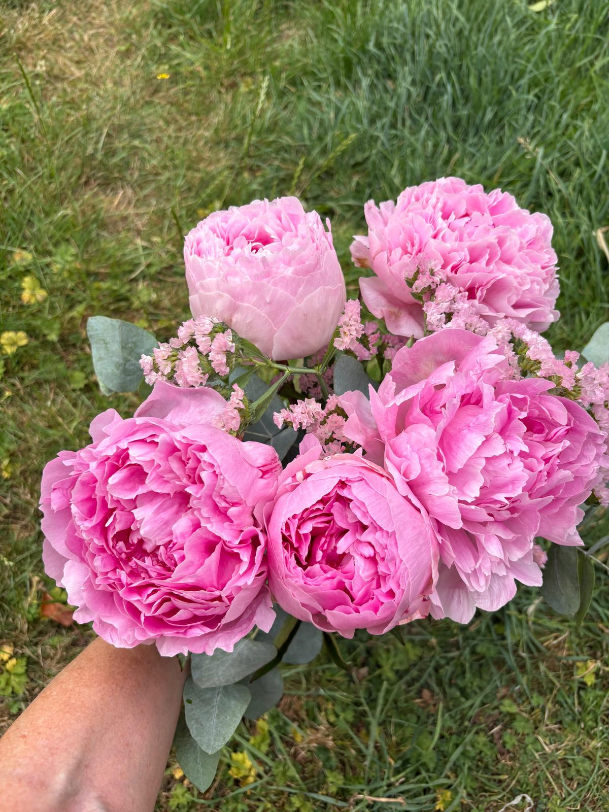
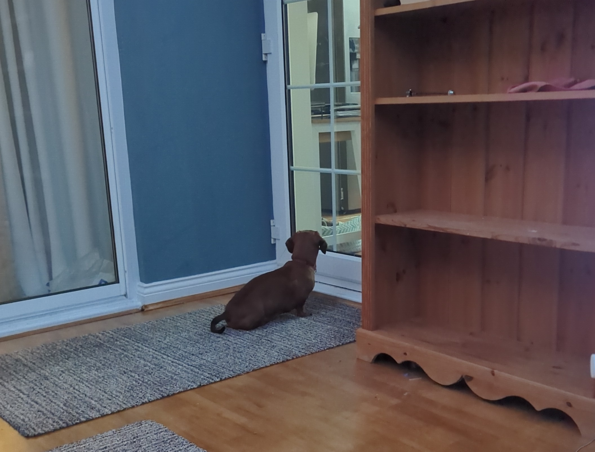
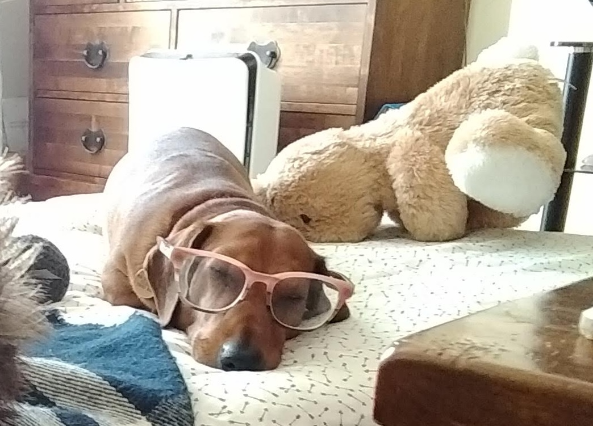
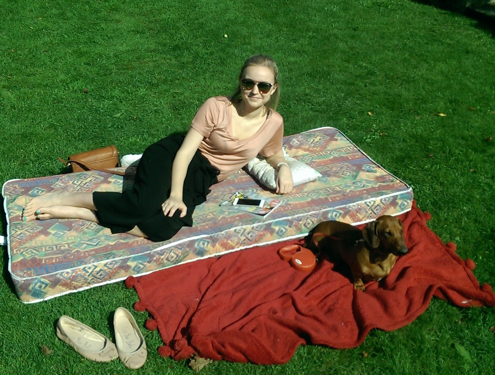
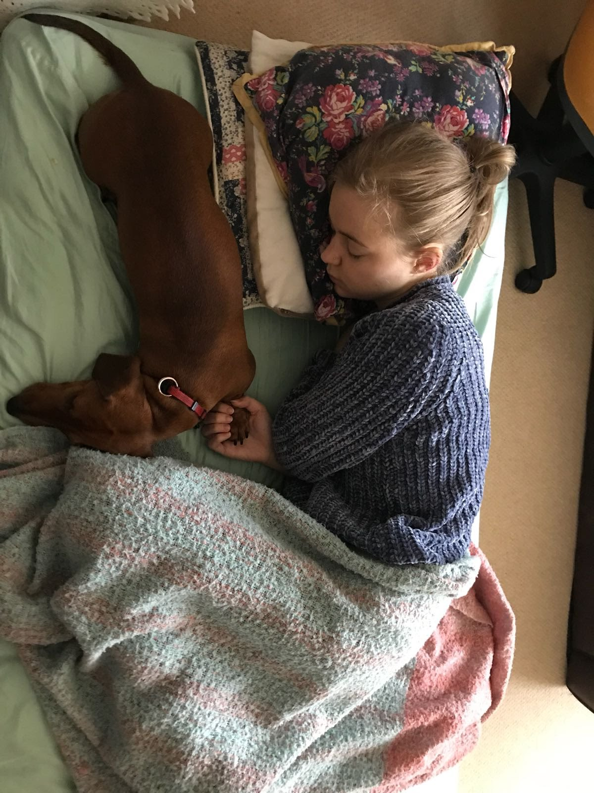
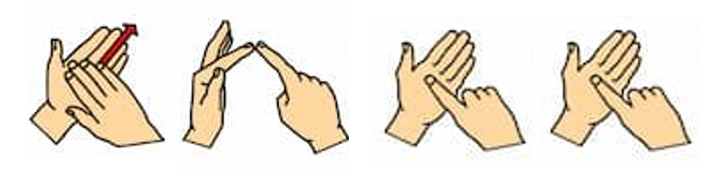
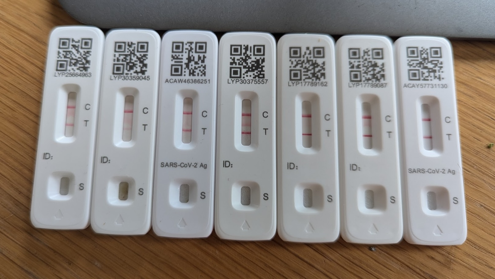

# Introduction

You may know me. You may not. I am Daniel Padfield, a microbial ecologist and carer. I live in Cornwall and my partner of 11 years is called Sophia Galpin. She lives in Cheltenham with her family and has very severe ME. She has been getting steadily worse for around 10 years, and is now bedbound in constant neuropathic pain. I visit every three weeks for 3 to 4 days.

The pain and suffering she gets through is very difficult to describe, but I have decided to try and document each visit in some, small way. This is my account, of how it feels to watch her, of how I see her suffering. This is my account because she cannot tell the world about what she is going through. Right now she cannot speak. Cannot text in full sentences. Cannot write.

*A warning that this set of posts are going to be very sad.*

## 06/04/2026 A relentless spiral.

Another very difficult visit to Soph's. During my time in Cornwall she had been quieter than usual, sending fewer messages with more emojis and fewer words. Several times she messaged me "Sori SS 🤫 💔", meaning "sorry I am so so quiet". This is heartbreaking because she is desperate to message, to communicate, to not be alone. Instead she is just suffering alone.

Its relentless for her. She fights to keep going everyday, to cope with the pain, suffering, and crippling vertigo. But also to keep the last slivers of communication, of light from the window, of eating and drinking, and personal hygiene. The last tiny parts of independence that are so important. But in doing so she burns well past all the energy she has, and through time she starts each day from a lower base. There is no respite in sleep. No restoration. 

This lower base is evident in Soph's increased light sensitivity. With spring here more light enters her room. Soph could have the blinds and curtains completely closed, but she stubbornly has them slightly open, likely because it helps her keep track of day and night. However, as clouds pass in front of the sun, the light in her room changes and gives her migraines. Even though she wears sunglasses every day. And dealing with this causes more fatigue. The spiral continues.

One lunch some soup dribbled down her face slightly. She has not got the energy to wipe it off, and she cannot tolerate someone doing it for her. Unfortunately she got some of that soup of the dress she wars She has no spare energy to change her dress, so she has to keep the top on all day until I help her undress in the evening. There really is no dignity in severe ME. I feel awful for not pouring the soup quite right causing it to dribble. I have the luxury of being able to shower and change clothes as needs be. Poor Soph. It is heartbreaking.

Her gradual worsening means the risk of hospital looms larger than ever. The tightrope we walk to keep her at home gets thinner. Soph knows the non-negotiables are whether she can eat, drink, and go to the toilet. And she will push herself beynd her limits keep those. Many people ask whether she should be in hospital and how we do not have more NHS help. The truth is the NHS doesn't know how to help people with severe ME. In 2024, Maeve Boothby-O'Neill died of malnutrition - she starved to death - because she did not receive essential support from Devonshire NHS trust. Prof David Strain, who works within that NHS trust, said he did not believe there was a "_ward anywhere in the country at the moment that can provide the sort of care that is needed_" for severe ME patients. Since then, Devon NHS trust has written [guidance](https://www.royaldevon.nhs.uk/media/nfapr5s4/planned-and-unplanned-admission-process-for-severe-or-very-severe-me-patients-clinical-guidance-v1-1b-007.pdf) for hospital admissions for severe ME patients, highlighting bespoke and tailored measures that are needed, but this has not been adopted by Gloucestershire NHS. This means we're not confident they would be able to care for Soph appropriately. 

And there is a risk of being reported to safeguarding. Karen knows many examples where emergency services have been needed for severe ME patients, and healthcare workers have reported the carers for potential abuse. Because if you don't understand severe ME and its complexities, then seeing Soph, with her matted hair resembling a bird's nest, her thin body, her inability to speak, wearing sunglasses in her dusty, dark room might raise concerns. And it should ring alarm bells, but not for safeguarding reasons. Because its a failure of modern medicine.

Copper turns 11 today. Soph sent me this photo of him.

{width="75%"}

She still doesn't know about his cancer. She fights so hard everyday to survive that there is no spare capacity to discuss this with her, especially given how badly she deals with emotional topics at the moment. Thinking about how she will react fills me with dread. Suppose we put it off until our hand is forced. When that time comes, I cannot imagine she will be in any better position to process it.

Finally - if you haven't already - you should support Karen running the London marathon by sponsoring her [here](https://www.justgiving.com/page/karen-galpin-2). It is the one thing she does for herself each year. No one deserves it more.

## 08/03/2026 three hours over three days.

It was a horrible 2.5 weeks between visits for Soph. She has been heroically and stubbornly trying some new meds, and the side effects made her worse, with none of the benefits. This is a recurring theme. Too ill to tolerate the side effects that prevent us from titrating up to an effective dose. The most fragile flower is the rarest and most beautiful. This means I received fewer - and shorter - messages. One day Karen let me know Soph skipped lunch completely. Another Karen had to abort after one mouthful because nextdoor was having a cable fitted and didn't let us know. Drilling so close to Soph's room was intolerable and Karen described Soph's response as "_like a seizure_". We don't get to try lunch at a different time. That was our one shot that day. We haven't explicitly asked neighbours to tell us when they are having work done on their house, or having gardeners round, but they know Soph is very poorly. And sound sensitive. Let's hope they never have to experience a drop of the suffering Soph does has to every second of every day.
Karen often has to go outside and talk to workmen and gardeners about Soph, and ask if they would stop work during her lunch or move their noisy equipment to the other side of the house. Most people are very accommodating. 

I knew this trip was going hard. Every trip so far this year has been. It was also a day shorter than usual. Soph's house is very close to Cheltenham racecourse, and this coming week is the Gold Cup, meaning that dozens of helicopters will fly rich people into the racecourse from 11am-8pm for four days. She feels vibrations through her bedframe all week that make her vertigo and other symptoms worse. After Gold Cup last year she told Karen "never again". And yet here we all are. Trapped. We know its going to be bad. She is starting from a lower base. The anxiety is palpable. I leave early so there is more time bewtween me being there and the races, as I take more of her energy than her parents do. 

I saw her for <3 hours over this time. I always forget how little she sees people. She never forgets. She must be so lonely. Its kind of unfathomably isolating. During my time lay next to her in the evening, her vertigo struck and she screamed piercingly loud. My ear was right by her. And yet - as ever - I just have to sit still and wait for her to manage it herself. If I move, respond or flinch then it risks making her vertigo worse. During lunch I have to watch her cover her eyes so I can re-fill the cup. Her left arm isn't strong enough (we think?) to do it on its own anymore. So she uses her right hand to move her left arm up to her face. She doesn't manage it first time, instead it takes her several tries of clawing at her right hand to be find the strength to move her left arm up to her face. After a couple of attempts, she tried to grab an eye mask instead that was just by her shoulder, but she missed it with her hand by millimetres, again and again. She then goes back to moving her left arm with he right hand. It looks like dead weight. Throughout all of this I just watch. What can you even say.

And yet, there are tiny interactions that make your heart soar. When you see the Soph you know still exists, trapped inside her failing body. I mentioned a sausage dog at Crufts this year that started to enjoy his bed a little-too-much. And she smiled. An actual smile. I felt so incredibly lucky. Unfortunately, smiling hurts. And takes energy. She started doing large, exaggerated hiccup-like gulps for breath and her vertigo triggered. No fun for Soph. This is why she spends so much time managing her emotions, any extreme negative or positive emotions make things worse.

```{=html}
<div style="text-align: center;">
  <div style="max-width: 80%; margin: 0 auto;">
    <blockquote class="instagram-media" data-instgrm-captioned data-instgrm-permalink="https://www.instagram.com/reel/DVlKHtNASw6/?utm_source=ig_embed&amp;utm_campaign=loading" data-instgrm-version="14" style=" background:#FFF; border:0; border-radius:3px; box-shadow:0 0 1px 0 rgba(0,0,0,0.5),0 1px 10px 0 rgba(0,0,0,0.15); margin: 1px; max-width:540px; min-width:326px; padding:0; width:99.375%; width:-webkit-calc(100% - 2px); width:calc(100% - 2px);"><div style="padding:16px;"> <a href="https://www.instagram.com/reel/DVlKHtNASw6/?utm_source=ig_embed&amp;utm_campaign=loading" style=" background:#FFFFFF; line-height:0; padding:0 0; text-align:center; text-decoration:none; width:100%;" target="_blank"> <div style=" display: flex; flex-direction: row; align-items: center;"> <div style="background-color: #F4F4F4; border-radius: 50%; flex-grow: 0; height: 40px; margin-right: 14px; width: 40px;"></div> <div style="display: flex; flex-direction: column; flex-grow: 1; justify-content: center;"> <div style=" background-color: #F4F4F4; border-radius: 4px; flex-grow: 0; height: 14px; margin-bottom: 6px; width: 100px;"></div> <div style=" background-color: #F4F4F4; border-radius: 4px; flex-grow: 0; height: 14px; width: 60px;"></div></div></div><div style="padding: 19% 0;"></div> <div style="display:block; height:50px; margin:0 auto 12px; width:50px;"><svg width="50px" height="50px" viewBox="0 0 60 60" version="1.1" xmlns="https://www.w3.org/2000/svg" xmlns:xlink="https://www.w3.org/1999/xlink"><g stroke="none" stroke-width="1" fill="none" fill-rule="evenodd"><g transform="translate(-511.000000, -20.000000)" fill="#000000"><g><path d="M556.869,30.41 C554.814,30.41 553.148,32.076 553.148,34.131 C553.148,36.186 554.814,37.852 556.869,37.852 C558.924,37.852 560.59,36.186 560.59,34.131 C560.59,32.076 558.924,30.41 556.869,30.41 M541,60.657 C535.114,60.657 530.342,55.887 530.342,50 C530.342,44.114 535.114,39.342 541,39.342 C546.887,39.342 551.658,44.114 551.658,50 C551.658,55.887 546.887,60.657 541,60.657 M541,33.886 C532.1,33.886 524.886,41.1 524.886,50 C524.886,58.899 532.1,66.113 541,66.113 C549.9,66.113 557.115,58.899 557.115,50 C557.115,41.1 549.9,33.886 541,33.886 M565.378,62.101 C565.244,65.022 564.756,66.606 564.346,67.663 C563.803,69.06 563.154,70.057 562.106,71.106 C561.058,72.155 560.06,72.803 558.662,73.347 C557.607,73.757 556.021,74.244 553.102,74.378 C549.944,74.521 548.997,74.552 541,74.552 C533.003,74.552 532.056,74.521 528.898,74.378 C525.979,74.244 524.393,73.757 523.338,73.347 C521.94,72.803 520.942,72.155 519.894,71.106 C518.846,70.057 518.197,69.06 517.654,67.663 C517.244,66.606 516.755,65.022 516.623,62.101 C516.479,58.943 516.448,57.996 516.448,50 C516.448,42.003 516.479,41.056 516.623,37.899 C516.755,34.978 517.244,33.391 517.654,32.338 C518.197,30.938 518.846,29.942 519.894,28.894 C520.942,27.846 521.94,27.196 523.338,26.654 C524.393,26.244 525.979,25.756 528.898,25.623 C532.057,25.479 533.004,25.448 541,25.448 C548.997,25.448 549.943,25.479 553.102,25.623 C556.021,25.756 557.607,26.244 558.662,26.654 C560.06,27.196 561.058,27.846 562.106,28.894 C563.154,29.942 563.803,30.938 564.346,32.338 C564.756,33.391 565.244,34.978 565.378,37.899 C565.522,41.056 565.552,42.003 565.552,50 C565.552,57.996 565.522,58.943 565.378,62.101 M570.82,37.631 C570.674,34.438 570.167,32.258 569.425,30.349 C568.659,28.377 567.633,26.702 565.965,25.035 C564.297,23.368 562.623,22.342 560.652,21.575 C558.743,20.834 556.562,20.326 553.369,20.18 C550.169,20.033 549.148,20 541,20 C532.853,20 531.831,20.033 528.631,20.18 C525.438,20.326 523.257,20.834 521.349,21.575 C519.376,22.342 517.703,23.368 516.035,25.035 C514.368,26.702 513.342,28.377 512.574,30.349 C511.834,32.258 511.326,34.438 511.181,37.631 C511.035,40.831 511,41.851 511,50 C511,58.147 511.035,59.17 511.181,62.369 C511.326,65.562 511.834,67.743 512.574,69.651 C513.342,71.625 514.368,73.296 516.035,74.965 C517.703,76.634 519.376,77.658 521.349,78.425 C523.257,79.167 525.438,79.673 528.631,79.82 C531.831,79.965 532.853,80.001 541,80.001 C549.148,80.001 550.169,79.965 553.369,79.82 C556.562,79.673 558.743,79.167 560.652,78.425 C562.623,77.658 564.297,76.634 565.965,74.965 C567.633,73.296 568.659,71.625 569.425,69.651 C570.167,67.743 570.674,65.562 570.82,62.369 C570.966,59.17 571,58.147 571,50 C571,41.851 570.966,40.831 570.82,37.631"></path></g></g></g></svg></div><div style="padding-top: 8px;"> <div style=" color:#3897f0; font-family:Arial,sans-serif; font-size:14px; font-style:normal; font-weight:550; line-height:18px;">View this post on Instagram</div></div><div style="padding: 12.5% 0;"></div> <div style="display: flex; flex-direction: row; margin-bottom: 14px; align-items: center;"><div> <div style="background-color: #F4F4F4; border-radius: 50%; height: 12.5px; width: 12.5px; transform: translateX(0px) translateY(7px);"></div> <div style="background-color: #F4F4F4; height: 12.5px; transform: rotate(-45deg) translateX(3px) translateY(1px); width: 12.5px; flex-grow: 0; margin-right: 14px; margin-left: 2px;"></div> <div style="background-color: #F4F4F4; border-radius: 50%; height: 12.5px; width: 12.5px; transform: translateX(9px) translateY(-18px);"></div></div><div style="margin-left: 8px;"> <div style=" background-color: #F4F4F4; border-radius: 50%; flex-grow: 0; height: 20px; width: 20px;"></div> <div style=" width: 0; height: 0; border-top: 2px solid transparent; border-left: 6px solid #f4f4f4; border-bottom: 2px solid transparent; transform: translateX(16px) translateY(-4px) rotate(30deg)"></div></div><div style="margin-left: auto;"> <div style=" width: 0px; border-top: 8px solid #F4F4F4; border-right: 8px solid transparent; transform: translateY(16px);"></div> <div style=" background-color: #F4F4F4; flex-grow: 0; height: 12px; width: 16px; transform: translateY(-4px);"></div> <div style=" width: 0; height: 0; border-top: 8px solid #F4F4F4; border-left: 8px solid transparent; transform: translateY(-4px) translateX(8px);"></div></div></div> <div style="display: flex; flex-direction: column; flex-grow: 1; justify-content: center; margin-bottom: 24px;"> <div style=" background-color: #F4F4F4; border-radius: 4px; flex-grow: 0; height: 14px; margin-bottom: 6px; width: 224px;"></div> <div style=" background-color: #F4F4F4; border-radius: 4px; flex-grow: 0; height: 14px; width: 144px;"></div></div></a><p style=" color:#c9c8cd; font-family:Arial,sans-serif; font-size:14px; line-height:17px; margin-bottom:0; margin-top:8px; overflow:hidden; padding:8px 0 7px; text-align:center; text-overflow:ellipsis; white-space:nowrap;"><a href="https://www.instagram.com/reel/DVlKHtNASw6/?utm_source=ig_embed&amp;utm_campaign=loading" style=" color:#c9c8cd; font-family:Arial,sans-serif; font-size:14px; font-style:normal; font-weight:normal; line-height:17px; text-decoration:none;" target="_blank">A post shared by Crufts (@crufts)</a></p></div></blockquote>
    <script async src="//www.instagram.com/embed.js"></script>
  </div>
</div>
```

Finally, Soph's incredible mum Karen is running her 20th London marathon on the 26th April for St John's ambulance. In 2025, the London marathon was the only day she did not spend the night at home caring for Soph. It is one of the only things she does for herself. She comes back a different person. She has something to talk about that isn't her daughter's suffering. If you'd like to sponsor her and let her know how amazing she is, you can do so [here](https://www.justgiving.com/page/karen-galpin-2).

## 17/02/2026 Another birthday lost.

It was Soph's birthday on Saturday. She turned 37. I didn't say happy birthday. There was no cake. Karen, John, Alex, and I had pizza from Franco Manca. Soph had a meal replacement drink alone in her room. Birthdays are not a celebration and haven't been for years. They are something to endure. They symbolise the passing of time. Of severe ME taking her precious time away. Of sustained, unimaginable suffering. Of her being trapped and (feeling) slowly forgotten. I promise her we will gain all the birthdays back. That every day will be a celebration when we are at home in Cornwall living our little lifey. Do I still believe that is going to happen? Does it matter if I do or don't?

Severe ME has taken so much from Soph. It is dehumanising and undignified in so many ways. Being bedbound and so ill is utterly heartbreaking. An example from this trip is my breathing: when I sigh or let out a deep breathe to help myself cope when seeing her, the noise hurts her ears. I see her wince. When my breathe touches her, it causes pain. I now intentionally send my exhales away from her. The whole thing is mad.

Yet Soph clings maintains any dignity and independence she can. Everyday when I go in for lunch, her nightie from overnight is neatly folded at the top of her bed, with her tissue box and other things placed next to it. I have no idea how she folds this neatly. She manages to move a pint of water and her other drinks and meds from her bedside table onto her bed to drink and take them, and is razor sharp when a med is missing. I have no idea how she does any of this. The gap between the table and the bed is small, but still a few centimetres. And her vertigo is so debilitating. It is hard to explain. It is there all the time and flares multiple times a minute, even in response to her own movements. She screams and shakes and has to hold onto something to ground herself. How does she move and manage her meds despite this! Karen and I have discussed it regularly and we still don't know. And we cannot ask her or watch her do it. She is incredibly resourceful, resilient, stubborn, and independent. To a fault.

She has so much love to give and does so much to make us feel cared for. She can get so much feeling across by a murmur and the tiniest touch of my hand. She sends us little prints and pictures on WhatsApp that she has spent her precious energy to find. She suggests we turn the heating on when it is cold and that we go for walks and does exercise. And she remembers everything! She sends my mum an emoji on her birthday. She will respond to a message weeks after and make someone's day. She just wants to live and make the world a better place. There are so many other examples I cannot remember right now.

I have thought about doing a post about how to communicate with Soph since I started this blog, but I have resisted. Mainly because I know she doesn't want people to message or contact her because I have mentioned it. And if you know her, you know that too. She wants people to message her because they want to message her. Because they miss her and think of her. But maybe you do think of her but do not know what to say or how to message her. Next time you think of her. When something reminds you of her. Tell her. Send her a single sentence like: "Saw X today and reminded me of you. Love you." And an emoji. And she will get reply to you eventually. And it will make her and your day. Any interaction with her right now is precious and a privilege.

This trip has been an odd one personally. It does not feel like it is dripping in despair like recent trips, but Soph's condition remains just as bad. However, compared to the last couple of trips where I have managed to do work, this one my my brain has felt like a puddle. I have spent hours doing relatively little, numbing my brain doing with Copper snoozing next to me. The hard deadlines of teaching definitely helped with the work productivity. Without it any work clarity has dissipated. I got a calf tweak so am off exercise for a few days. Good job I don't increasingly rely on it for my endorphins and to stave off depression.

And Copper is still fine, but he is becoming a lumpy boi. A new one behind his front left leg is probably the cancer spreading to another lymph node. Sigh. He has to keep going a while yet.

## 25/01/2026 Every new day turns into the worst of her life.

This bit hurts my brain. Many of us discuss the toughest times of our life. We sometimes reflect on the worst day of our life and how we felt during that time. Maybe how long it lasted and how we got through it. Soph has faced the worst day of her life - or very close to it - everyday for years. She knows this. She knows there is no quick end in sight. No miracle recovery coming round the corner. If she does improve, it will be slow and gradual. To get back to where we were when I started this blog could take years. And she knows that. And yet she wakes up everyday right now, into a new day that becomes the worst of her life. And gets through it. I do not know how.

This trip was maybe as bad as the last somehow. The lack of communication and watching her suffering worsen is incredibly difficult to watch. While I did manage to do soup better this trip (until leaving day), lunches were still traumatic for both of us. One soup was slightly too thick which made it difficult for Soph to take in while lying down. I suggested we stop and do a meal replacement drink instead. She said no. She somehow did 3.5 mouthfuls, even though I felt like I was just pouring it into her mouth rather than her actively drinking it in. I had flashbacks and fears of her choking again, but thankfully we avoided that. However, some soup spilled out from the corner of her mouth and made its way down the side of her face, thickening as it cooled. I wanted to offer a tissue but she could not take one. She has no energy spare to clean it off. She has to just leave it. Karen went up an hour after lunch and it was still there. MECFS has taken so much dignity away from her. It breaks me.

The lunch on leaving day was perhaps the worst ever. I got everything ready, but it was clear she was already far past her energy envelope before we had even started. We did not even attempt one mouthful. Instead I watched her suffer and try and force herself to be ready. To try control her vertigo by grasping and clutching onto the bed and biting her lip. To watch her have what I can only describe as close to a seizure. I sat in silence, before saying I should leave. She put her arm over her face and I left. I did not even get to say goodbye and I won't see her for over 2 weeeks. I am broken.

And as things get worse and taken away, any interaction we have is precious. Even time spent with her with no interaction is precious. A smile I got when intentionally misunderstanding a sign she made. The tiniest strokes of my hand or face. Times when I understand her, times when I don't. I feel so privileged to actually see her. Even though it tears me apart. I am lucky to be on of the few people who gets to see her. She is incredible and witnessing her strength and force of will to get through each day is precious. I have no idea how she does it. 

Copper continues to carry on oblivious to his impending demise. This is a blessing. He spends most of his day sat on me under a blanket. That is something.

## 07/01/2026 The worst visit ever.

How can she get worse? First visit of 2026 and before I saw her Karen warned me Soph's vertigo was worse than my last visit. Little did I know how much worse it was, and the devastating knock on effects for everything else. Any slight movement sets the vertigo off. Even her own movement. It must take so much of her energy to control and respond to. And this means less energy for everything else. This was the worst trip ever.

We had the three of the worst lunches I have ever had this trip. Her vertigo was so bad we only managed 2.5 mouthfuls of soup one day, 1.5 mouthfuls the next, and my final lunch (just before I leave) we decided to not even try. It would be relatively calm and then any slight movement would set off her vertigo. Sometimes there is no movement and it still happens. I cannot imagine what it feels like, but it looks frightening. She clings to anything she can hold onto, her mobile phone holder or bedside table. And she screams. Harrowing screams as she tries to manage it. And I just have to sit there. I cannot touch her. I cannot help. Any attempt I make to do so will just make it worse. 

Her arm flailed and knocked over a pint glass of water. The shock of this made her scream out and then lunch is over. But I had to wait for her to cover her eyes so I could leave. She puts her left arm over her eyes so me moving around doesn't worsen things. But she cannot move her left arm on its own. We think because its weak, but we cannot exactly ask. Instead she uses her right hand to move her left arm. Her right hand claws at left arm, unable to get it up to her face immediately. Eventually I walk out. I tell her I love her and how amazing she is as I pull the door to. She winces at the noise of me closing the door.

 On the day I left, we did not even try the soup. Soph made the heartbreaking decision to do a small amount of meal replacement drink instead. She hates giving stuff up. I was hoping this would allow us to have time to just be, to say goodbye, but the vertigo was too bad. I could not understand her. I could not really say bye. The vertigo this trip took yet more from us.

And all of this leaves me in a state of anxiety, depression, and dread. A feeling where your heart is in thousands pieces but there is a huge amorphous blob of blackness in your belly weighing you down. When the feeling is so crippling that even numbing yourself and zoning out feels like too much effort. It would be really nice at some point to not have to discuss current and future care of my partner with my partner's parents. And yet I ended this trip discussing how if symptoms get so  bad that Soph cannot eat, then she will have to go to hospital. Even though there are countless reasons why that would make her worse.

## 20/12/2025 When you cannot communicate, how do you deliver bad news?

**You all have to promise not message Soph about this, as she still does not know.** Early September, Copper was struggling to jump over door lips. He would just sit there hopping from one foot to another in front of it trying to work out how to cross this immovable, uncrossable barrier. He would not be very good at agility. He slipped a disc during COVID which meant he lost the ability to walk on his back legs. Thankfully he more-or-less completely recovered with crate rest, but his uneasiness at jumping even tiny obstacles was worrying. Had it happened again? We took him to the vets and they could not induce any pain along his spine, but they did find that one of his lymph nodes in his back leg had a big lump. They took a biopsy. Cancer. Shit. A whole body MRI later and turns out Copper has inoperable cancer. Cancer that we removed on his paw 3 years ago has spread to a lymph node on the same leg. He has a lump and lots of other tiny nodules in his lungs. Double shit. They tell us they think he has maybe 6 months given the MRI results. Triple shit.

{width="75%"}

Copper dying will be  very sad. He is oblivious to the stress the rest of the house absorbs and lives with daily. He is a constant presence for Karen during the day, getting cucumber during lunch and being around in the kitchen while she is. He watches Eastenders every night on the sofa with John who calls him his grand-dog. John has for months been carrying the little sausage to his crate at bedtime, and lifts his snuggle sack up so Copper can walk straight into his warm, snuggly bed. Alex asks where he is everytime he comes into the kitchen to grab a drink during a work break. And invariably goes and gives him some scritches. And he is my living hot water bottle on all my visits. I take him on walks, he cuddles up under blankets and he makes me smile when nothing else does. He has been in all our lives for ten years. It will be a huge loss to us all. 

**But how do we tell Soph?** That is the worst part. She has not seen him for years. He represents perhaps the best thing that came from the illness, as we got him when Soph could no longer work so could help train and look after the little sausage boy. And now he is dying. We know she would want to know. But we also agree the news would probably make her worse. Do we tell her straight away? Do we not tell her at all? Do we tell her when he starts going downhill? How do we tell her? How can we tell her when she is so poorly and communication so difficult? What words shall we use? Should I do it or should Karen? We discuss these things for hours.

It is now nearly Christmas. Copper is doing generally fine. He has a bit of a cough a few times a day, but suppose that could happen if you have cancer in your lungs. He had a bad reaction to the pain medication Metacam he was on which involved him having bloody diarrhea and vomiting every two hours for ten days, but he is over that now. And I have come to terms with the guilt I felt at Karen and John having to deal with my poorly dog on top of looking after Soph. We are halfway through the 6 months we were given. He remains oblivious to his imminent demise and long may that continue. Copper is so nonchalant about it that John keeps saying that they diagnosed the wrong dog. 

Copper still being fine has allowed us to kick the can down the road with telling Soph. The last few visits Karen has told me how she has _nearly_ brought it up, but we have been veering from crisis to crisis and there is just not enough time with her and she is not well enough to deal with the conversation. I feel awful that Karen is the person telling her, but not as awful as I would feel if I had to do it! So she still does not know. That the dog she loves, that is a symbol of the life we had in Cornwall and part of the life we want to have again, is going to die in the not too distant future. To her he is still 4 years old. He needs to stay 4 forever. She will need to say goodbye when the time comes. Somehow. Captain Monk Monk. Mr Stink. The sun dog. Tiny little sausage boy. Copper car. Merry festive times everyone. I was trying to think how to sum up 2025.That "_my dog having inoperable cancer but currently being fine_" is currently one of the saving graces of the year does it nicely.



## 25/11/2025 A cough that won't go.

I felt run down halfway through my non-isolation week. Super tired, a bit achey, and the start of a sore throat. I dreaded that I was ill, but in reality it could just be long, busy days at work and commuting on my bike in the cold, dark, and the rain. And that when I am not self-isolating I stay super busy with socialising in the evenings and doing 5 lots of cardio a week. Or the fact some night I drink two thirds of a bottle of red wine alone on a weeknight. All the behaviours that hint I am not doing well mentally were heightened, so I was convinced it was just stress. It is fine to get ill normally, but I just cannot afford to as it makes going to Soph's super complicated.

At some point this developed into a cough. Plenty of time to get rid of it though as I had not even started self-isolating. When I started on Sunday I started chain-drinking lemsips and First Defence to try and get rid of whatever it was, even if I wasn't sure I was ill. However the cough did not go. I told Karen I had cough - but felt fine otherwise - on Monday and we would play it by ear for Thursday. Soph knew I was run down and now have a cough. She was - rightly - extremely anxious about catching anything.

I took each day as it came. I did not know whether I was going up to Soph's from one morning to the next. I wanted to ask Soph but she cannot communicate. I wanted to ask Karen but she had enough on her plate. If she had not let me know, it was because she was dealing with unimaginable stress, pressure, and heartbreak, not because of any oversight on her part. She also had to spend the "quality" time she gets with Soph discussing whether or not I can come up and what precautions we will take. Knowing this makes me feel so guilty. So I just waited, sometimes not knowing until that morning whether or not I am travelling up. But that did not do great things for my mental health, so I booked Friday off work.

I finally made it up on Sunday. Not that Soph was particularly happy with the decision, but the prospect of not seeing me for 7 weeks was worse. Usually I would delay my return to Cornwall to make sure I am still at Soph's for the same number of days. However, I have a conference in Liverpool on Tuesday so am now on a train there. I had planned to see my family before the conference, but have cancelled that to spend as long as possible with Soph. Yet this visit is still only one full day compared to the normal three. The time we do have together is so hard. She has a flare up of a recurring ear infection at the moment which makes it painful hearing any sound. She whimpers and recoils when your trousers touch the bed, when the door opens, when you whisper or speak quietly. The time we have together is more limited and heartbreaking. It doesn't rain, it pours and all that. I feel so guilty. So angry. So helpless.

This is the tightrope we walk. I want to live as normal a life as possible when I am not at Soph's, but that runs the risk of sometimes getting ill. And sometimes those symptoms last even if I am likely not infectious. And as it becomes harder to communicate with Soph these nuances and discussions of risk become harder and harder. It just really sucks. The whole thing is just so desperately, deeply shit and sad.

## 02/11/2025 Suffering that she cannot describe, and I cannot imagine.

Lunches are the hardest, Every other one now seems to rip me to bits. She is just suffering so much. Holding back tears and gathering herself before every mouthful. Pulling at her nightie because she is so much pain, stretching it over her body to try get some relief. There is none. And yet every time she still manages to do 4.5 mouthfuls. No matter what she pushes through. I do not know how she gets through each day.

Watching Soph suffer is slowly heartbreaking, but I still get new realisations even now. She describes herself as being locked away, but I realised recently that she is locked away with so much she intentionally hides from us. So much pain, suffering, and heartache. She shields us it, like Gandalf fighting off a Balrog. She fights the equivalent of a Balrog everyday, basically alone. And its written large all over her face, despite her trying so hard to hide it, which contorts and grimaces, and I feel duty-bound to watch. And all of that internalised screaming and suffering has to go somewhere. It is just my perception, and I cannot ask her if this is the case, but this constant repressing of everything seems to come out in twitches, jerks and flails. And they are getting worse. One lunch this trip her arm and hand jerks lasted so long and were coupled with some noises that I thought "_this is what a seizure must look like_". I tell her "_that was scary_". We agree and hold hands. I cannot ask any questions about it, as she does not have the energy to ask about it.

My ability to understand her has not improved. I am not used to it. I will never be used to it. Her mouth moves but only murmurs come out. What am I supposed to do? She makes a sign but they're so limited at the moment that the same sign can mean multiple things. So I guess. I get it wrong. I feel like utter shit. The more I get it wrong, the worse it gets. She does not have the energy for this. In the end she zips her mouth and we sit in silence. I speak to her but she does not respond. I know she is listening, but she does not respond. There goes my heart into a million pieces.

I walked the dog in Pitville Park this afternoon. Autumn is Soph's favourite season. I brought back some leaves for her to smell and look at. She loves the reds and oranges the most. This **is** lovely, but in a heartwrenching way. She has not seen outside - let alone been outside - for well over 2 years.

## 12/10/2025 We're all trapped.

Soph is increasingly locked away, trapped in her own body. Her ability to communicate has worsened. I do not think I understood a single word this trip, and maybe only three or four signs. The words are imcomprehensible murmurs at the moment. Does she think she can still be understood? Ironically there are no words to describe how much I hate not understanding her. It devastates me and I am in a state of grief at losing that connection.

Everything is exhausting for her. Itching. Coughing. Listening. Even having someone else in the room. She no longer has the strength to move one her arms towards her head so has to use her other hand to help it. In the evening, I know it is time to leave her room because she can no longer control her body well. Her arms start flailing and twitching due to overexertion and she lets out anguished screams. Whenever we are with her, for our benefit she expends a lot of energy holding everything together (even though we tell her not to). 

Her nausea is so bad at the moment. One day this trip she skipped lunch because of it, which meant we lost 10% of our time together. And only she could make this decision. I hate it. She also finds strong smells overwhelming and nauseous, so we are very careful about what we wear, wash with, and cook. I cooked a curry thinking it would be fine, but the smell was too strong which ruined our evening time as it caused nausea which brings fatigue. I feel so guilty for destroying what little time she gets with people that day, and some of the precious little time we get together during a visit.

In spite of this, her ingenuity and determination is astonishing. She communicates best now by answering yes/no questions with noises. She also taps my hand with her fingers to indicate a whole array of feelings and thoughts, and her ability to get things across with the tiniest stroke or the hint of a smile is unmatched. And through WhatsApp she continues to be able to get across complex things with emojis and broken text. She has so much to say and give the world if only she gets the chance. 

I'm not trapped in a loveless relationship. If anything, the deep love Soph and I share for each other has trapped me in a life that makes me depressed by definition. You cannot see and observe and be with Soph without it tearing you into pieces.  Visiting Soph's every three weeks is like micro-dosing despair and depression, and there is no escape from Soph's illness even away from Cheltenham. I feel pressure to send voice messages to Soph daily, every 2 to 3 hours from 11am, to let her know what I have been doing, and how I am feeling, and letting her know how amazing she is. I know that her parents use these voice messages as easy and regular topics of conversation when they have time with Soph, and this has become ever more important as Soph's communication has gotten worse.

I am aware **I COULD** leave, and many people have asked me why I don't and haven't. That they couldn't do what I am doing, but you don't know how you would react until you are in this situation. Its simple really. I love Soph deeply. She deserves the best chance to get better. I believe that includes me being in her life, and Soph, Karen, and I are a formidable team that rely on each other. I also have a deep fear that if I did leave, if I could not do it anymore, that it would make her worse to the point of giving up. I do not consciously consider these thoughts often, but I know they are always in my mind somewhere. Hence the depression. The feeling of pressure. The anxious black circle of doom that lives in my stomach most of the time. Its just that Soph's love makes everything worth it. And the chance - however small - to see her get better. And to live our little life.

## 21/09/2025 Soph's phone stops charging.

We all rely on Soph's phone. She uses it to listen to voice messages throughout the day, to tell us what time to enter her room during, as well as sending us emojis, suggesting soups, and giving updates and asking questions. It is her whole life. Although we know she cannot use it much, we know she still sometimes sends and receives messages from friends, goes on the internet, and documents her illness. Her phone is her only window into the outside world. And last week it stopped charging. _DUN DUN DUN_

This trip therefore coincided with the need to move across to a new phone, but how do you do this when you can barely get the phone, and cannot communicate with the person whose phone it is? Her WhatsApp had not backed up since 2021 due to a lack of storage (on iPhones WhatsApp creates a local backup before uploading to iCloud) and Soph was **very** clear she did not want to lose any messages. Me and Karen felt deeply responsible for this, and the pressure made us very anxious.

Soph allowed us to have her phone for a few hours over a couple of evenings. We did an encrypted backup of her phone onto Karen's MacBook and moved that onto a new iPhone. It seems to have worked! She still has all her messages, all her photos, and all of WhatsApp appears to be there. She now has the new phone, allowing me to get messages such as "Mysm hurts 💔" [Miss you so much it hurts 💔]. Lucky me. 

The phone switch seems to have gone _relatively_ smoothly, but the phone issue has created a lot of stress for Soph. And it made this visit even more difficult. When I problem solve I go down multiple avenues to come up with a solution, but discussing these with Soph caused an information overload for her. And then I relied on Karen simplifying things and making sure we understood Soph's wishes. It is so hard not being able to understand her. I am not sure I was able to understand one word this trip. And then I put myself in Soph's shoes and my my heart falls to bits. How can she possibly be more locked inside her own body? And yet here we are. 

The last ten years have been defined by periods of stasis and then declines in Soph's health, after which we get used to a "new normal". This seems to have been replaced in the last few months by every trip being worse than the last. It does not seem possible.

From Soph's I have actually gone on a holiday. This might be the first time I have been abroad in 8 years. Cycling in the Pyrenees. A holiday that Soph would not have wanted to do with me lets me not feel so guilty about it.

## 25/08/2025 The worst lunch is the one she does not have.

The worst lunchtime with Soph was a few months ago. It was a lunch   where I drive home straight after; its beyond horrible to say goodbye. That time, on her last mouthful she did not swallow properly. I poured soup into her mouth and she just let it fill up. She did not have the energy to swallow. I pulled the cup away. She was choking and I couldn't do anything. I just watched as she choked and coughed and spluttered. Then I left. As things have gotten tougher this year, I thought at least lunch has not been as bad as that. Then this trip, somehow something worse happened. 

Soph messaged a time for lunch: "**57** [14:57]". 

Then she put it back: "**3** [15:00]". 

Then back again: "**05** [15:05]". 

And finally: "**1/2 V b. N sit** [0.5 of a vanilla meal replacement drink. Do not sit down]". 

She could not do soup. This has never happened before. I just went in and put her drink on the side. I could not ask what happened because she could not tolerate me being in the room. We all spent the afternoon reeling trying to busy ourselves. What happened to her? Is this going to be the new normal? The new routine? It cannot be. We have so little as it is. Severe ME takes everything from us eventually.

Thankfully she did soup the next day, but the trend is clear and terrifying. Unsurprisingly, I have been in a real low ebb for a month or so. I take antidepressants, do a lot of exercise and go to counselling every third week which allows me to function most of the time. But I am really struggling at the moment. There are days I do not want to get out of bed and face the world. I nap in the day because I am emotionally exhausted, and sleeping is the one guaranteed way to escape everything going on, at least for a small time. I have coping mechanisms to get through each day that stack to help me through long periods of time, but I do not specific mechanisms to pull myself out of the big hole. It has always just passed. I am sure it will again, but when its happening you never think it will.

## 06/08/2025 The impossible decisions Soph has to make.

There are no words for the suffering Soph goes through everyday, despite my best efforts here. It is surreal to sit down and try put into words what her - and our - life has become. Yet all the physical manifestations of her severe ME make it easy to forget about the mental anguish she experiences daily. She has to make impossible decisions about what to do and prioritise. This is my attempt to shed light on that, knowing that I cannot know what it really feels like.

The choices Soph has to make are never good. We can rarely make decisions for her as she knows her body better than we do, and helping her make decisions and discussing things has become more difficult as communication has become harder. Essentially, she has to eat and drink, and go to the toilet (using a bedpan). These are the non-negotiables to stay alive. If she can't do this, we would struggle to care for her at home (although there is nowhere else for her to go). So as her energy envelope gets smaller, there is less energy for everything else. And Soph has to make those decisions. Can I look at this photo? Can I listen to this voice message? Can I have someone in my room for 1 minute more? Can my partner stay an extra day? Can I send my partner words or just emojis? How many messages do I have the energy to send today? Can I eat soup at tea, or can I only manage a meal-replacement drink? Imagine having to make those decisions every day. Imagine choosing to limit your company to ~1 hour a day despite feeling utterly alone and being unable to watch TV, listen to podcasts, read. You just lie in suffering and think. Imagine having to knowingly do that to yourself. These are horrible, unfathomable decisions. When I told her about the topic of this post, Soph communicated that "_there are so many decisions you do not even know about_".

Through time, we have had to come to terms with these decisions. I stay one day less than I did last year. I used to do soup at tea, but Soph's dad (John) does it now as he is quicker than me. For weeks Soph would message before tea and write "D💔" to let us know John was doing it. She would send this message as late as possible, delaying the inevitable in the hope I could do it. This is now happening with the meal replacement at tea. She is desperate to have soup again, above all for to see John more. Sometimes she will send Karen a soup to make, only to message closer to tea that she will have the meal replacement. It is heartbreaking.

Ultimately, this led to one of my worst lunches with Soph. She ate her 4.5 mouthfuls of soup as usual, but there was no effort to communicate. She asked no questions, made no hand gestures. She had no energy for any sort of connection. That is the first time that has ever happened to me. It was so scary. We sat there mainly in silence, despite her being alone since 11pm the night before and being more alone and lonely than ever.

It has been harder to understand Soph this trip. More than any other I can remember. "_Sorry I cannot understand._" might be the thing I hate saying the most. It breaks me to watch her try and speak, communicate and connect, and yet only a murmur comes out. Less than a murmur. And it takes so much effort even for that. Felt like the end of days.

I did manage to find some hydrangeas on campus and bring them for Soph. Karen told me she quite liked them, so I stopped on my drive up and stored them in a coke bottle for the 4 hour drive. She LOVED them. It really is the little things at the moment. I also got at least two smiles. Increasingly rare, precious smiles.

{width="75%"}

## 12/07/2025 A greatest hits of despair

Karen, John, and Alex moved Soph on Wednesday. It was more traumatic than the first time. I am told she screamed in pain like we had never heard before. Alex carried her in the end because she would not go on a trolley again after the last time. One of the conditions is that she had to wear a neckbrace which she somehow put on herself. She is extraordinary. Nevertheless I am quite happy that I was not there for the move. That I did not hear those screams. She is now back in her room with air conditioning which is a huge relief as it has been >30ºC every day of this visit. Knowing Soph has the air conditioning just reduces everyone's anxiety, and it has been nice not having to worry about running water and using the kitchen. The kettle has moved in from the conservatory for the first time in >3 months. However, everything is a trade-off.

It was a truly gutwrenching lunch today. She started by telling me - in her own way of muffled speech and signs - that "_the crash is stepping up_". I could tell her vertigo was bad today and her hands flailed and she let out the scream as I imagine she could feel the whole room spinning. I pride myself on being present whenever I see Soph. In being observant. She tries so hard to hide things to protect us, it is the least I can do to watch how she does it. I can tell apart the different faces she makes when she is holding things in. There is one where she is holding in emotion, tears, stopping herself from crying. This often ends with her slowly moving a closed fist from her neck to her chest, and she used to say one of her mantras of "_hold it in_". Then there is one where she is holding in pain, where she flinches and grimaces, and I can see her clench and hold in what I imagine would be a harrowing scream. I wish she just let it out sometimes. Finally, and this is a newer one, is she stops herself from being sick after every mouthful of soup. Her nausea is so bad now. She puts her hand over her mouth as if she is going to be sick. She has never been sick. I got all the greatest hits of despair this lunch. I also could not understand her so after a while she had to stop trying, and indicated this by putting her hand over her mouth and zipping it shut. Her vertigo was bad, and any slight movement I made seemed to set it off. She still managed her 4.5 mouthfuls. I have no idea how. And at the end I just had to leave. She pointed to her wrist to indicate we had had no time. I agreed, but there is nothing either of us can do. I left, went downstairs, and felt broken.

Given the vicious payback, maybe it is fortunate this visit is shorter. I arrived on Thursday evening and am leaving first thing on Sunday. I maybe saw Soph for 2.5 hours. I have a workshop I am going to for a few days in Sussex about the importance of body size in determining structure, function, and evolution of communities! I am giving the first talk of it, tomorrow at 2:30, about the same time I had this these greatest hits today. Soph wished me good luck in makaton this evening. We are all doing our best and everything still feels impossible. Life continues to be crazy and surreal.

## 21/06/2025 The stress of heatwaves

We knew the heatwave was coming. We wanted to move her back into her room that has air conditioning. Karen tried most days for 2 weeks to discuss this with Soph, but it was so difficult. Soph only gets to have company for <1 hour a day, so it is no surprise that she does not want to spend it discussing logistics. She is so scared of moving after our method last time was more traumatic for her than we envisaged (and we thought it was going to be bad)! And it remains of utmost importance for everyone that Soph has a say in her care and keeps as much choice as possible, and this extends to moving her.

Consequently, despite Karen and Soph's best efforts, it has been >30ºC Thursday, Friday, and Saturday and she is not back in the room with air conditioning. It has been a very stressful few days. Usually Soph has her door closed for 18 hours a day to reduce the fatigue as a result of the stimulation from feeling and hearing the coming and goings of the house, and for privacy as she does all her personal hygiene in bed. With these temperatures her room becomes a hot box, like being in a tent in mid-summer. And her overheating makes all of her symptoms worse, and this piles on day after day. It has been very distressing to watch.

It is always inspiring visiting Soph as how Karen is neverendingly thinking of ways to help, and Soph can make changes that we would not have thought possible. If we run the aircon and Soph has her door open then eventually the cool air moves across the landing and into her room, such that Soph has agreed to have her door open more, to about 9 hours a day which is amazing. At night, Soph has had her door open from ~11pm until 1am ish, but because we need her normal bedroom (where her parents have been sleeping) door open for the aircon to do its thing, Karen and John have been sleeping in the lounge. I then set an alarm for 1am and close the door when Soph messages me soon after. However, on Sunday I slept through that alarm and woke at 3am to messages from Soph and Karen, who told me that she had done it instead. Embarrassed and disappointed in myself.

Despite all our best efforts, Soph is still so hot, and its been making her worse. This ultimately means she has less company in the day, has to be in more darkness, and has to suffer alone more frequently. She cannot shower, cannot have cold things on her, cannot drink freezing cold things, and Karen has been struggling to change the sheets. Lunch yesterday was harrowing. She spent the first five minutes holding back crying. "Not allowed", she regularly tells us. Her vertigo was worse and when she screams and reaches out for grounding I just have to sit still and watch in silence. Worried that any movement I make will just make it worse. It can take minutes for it to pass. She managed the normal 4.5 mouthfuls of soup but I have no idea how. Pure force of will. We did not manage to speak about anything. Later she tells me her sheet is ripped in three places. Soph's grace and defiance in the face of such suffering and undignifying circumstances continues to astonish me.

It is easy to think the things we do don't make a difference, despite the fact our care is literally keeping Soph alive. Turns out there is one thing that gives her a huge lift. Peonies! Watching them start as a bud and open slowly into huge, complex, beautiful flowers is her favourite thing. She will watch them from afar during the day and at night for two hours we bring them much closer so she can see them in more detail. It is the closest thing we have found to bringing nature indoors. Of a biological process she can watch unfolding in real time in her bedroom. It is a privilege to be able to give her that. Yesterday she sent me this "🌸 open ⬆️ evry ⏰ I 👀! 🤩". She is a very special lady.

{width="75%"}

Also just because, here is Copper howling while sat in my arm. I sent it to Soph on Saturday and yet you will still probably watch it before she can find the energy to.



## 01/06/2025 A paradoxical weekend

This visit was as hard as ever. I am struggling so much to understand Soph, even as she tries ever harder to communicate. And every attempt at communicating takes energy, so every time I get it wrong we have less time to actually interact. I watch as she exhausts herself while I desperately try and guess the letter it starts with, or get the sound of the first syllable. Its no use, after a few attempts she pretends to zip her mouth shut. She has taken the decision to stop trying this time, for her own self preservation. I feel guilty even though there is nothing more I can do. It is a delicate balance between wanting to discuss things that are of interest and actually being able to understand each other. The despair returns. 

And yet, we have all been so relieved it was just THIS awful. This level of heartache. The Wychwood music festival was this weekend, and we had premonitions of it being as loud and disruptive as last year (which inspired the beginning of this blog), which would have resulted in me barely being able to see Soph and seeing her deteriorate further. Instead, we have barely heard it. A win. A stroke of good fortune. I cannot remember this feeling at Soph's! The festival has made some changes as a result of the complaints last year, and the wind has been in our favour. It is impossible to disentangle one from the other so I am worried about what might happen with different wind next year. But lets take the win. It was only **THIS AWFUL**.

This weekend highlights the oxymoronic nature of caring for Soph. Seeing Soph while she fights everyday is the most heartbreaking thing I will likely ever have to do, but simultaneously all the time I spend with her is precious, a privilege, and the most important thing in my life. It is something I look forward to and dread in equal measure. It is the main reason I take 100mg of sertraline a day, have counselling every three weeks, and the reason I struggle to function. But when you see her defiance and strength, glimpse a little of her wicked sense of humour or a fleeting smiles, it makes everything worthwhile. As Superhans would say, ~~that crack is~~ _those moments are_ really moreish.

There are other examples of this paradox. As Soph is alone in her room for ~23 hours a day, small things really matter. The soup she eats and its temperature (she likes it molten despite having burning mouth syndrome). The position of the blinds and curtains. The amount the door is open. The chocolate she has in the evening. At times this can be frustrating when we do not get things right. Karen and I will compare notes and sometimes be exasperated at our inability to get things right. But on the other hand, the fact she still **cares** about this stuff is a beacon of hope. That it still matters what soup she has, what herbs go into it, whether the cauliflower is roasted or not. That it still matters how light her room is and what flowers she can look at for 45 minutes at night. Every decision she makes and every critique she gives us is a blessing, a sign she is still fighting, that her spirit has not gone.

This blog also marks a year of me writing it. Thanks for reading, and wanting to know a little more about how Soph and her family live, and what is like to care for someone who has so much to give the world, but is cruelly trapped in her own body. For example, yesterday we worked out she has never heard the word "**YEET**" because she is so detached from everything.

## 19/05/2025 There and back again and the dreaded chat about dates.

For my career, I am a sort-of-ok scientist. I study how bacteria and other tiny organisms interact with each other, and how they respond to changes in their environment, like climate warming. It is a pretty sweet gig. I get to learn new things, teach people those things, and work with nice and mega intelligent people. It is also super flexible at the moment, and I am super grateful for the unending support of my work colleagues that has allowed my career to continue - and go surprisingly (to me at least) well.However, I have chronic imposter syndrome and anxiety about my productivity and worry about my lack of enthusiasm, which inevitably bleeds into my work-life from the depression and anxiety that comes from caring for Soph. Somehow reading papers and doing science does not feel like it matters when the day before I was holding a cup for my partner to eat soup.

One really hard thing is planning. Any form of planning. I try to visit Soph every third week, but this can change if I get ill, if Karen, John, or myseld have something planned. And before each visit I self-isolate for 5 days. This makes it very hard to plan for work, or to plan holidays. It has also become nearly impossible to discuss visit plans with Soph, such that it is much easier if we can keep to a regular schedule. As such, Karen and I sit down with the calendar most visits and discuss dates for the next few visits. It feels so cold and transactional, and it is horrible to do it without Soph. Coupled to this, the amount of travelling I do on the M5 to and from Soph's (its about 4 hours each way) means when I am in Cornwall I do not want to leave. And I feel so exhausted balancing caring for Soph, the toll it takes on me, and work that I rarely have capacity for anything extra. Ultimately I live day-to-day and week-to-week, trying to keep my head above water.

I know this way of living isn't really compatible with modern life and modern academia. I need to be able to plan things for work. To be able to do experiments, submit grants, and for teaching. I discuss it regularly during my counselling sessions. Yet as Soph is the priority, I just cannot see anyway of doing it better than we currently are. And when I do visit. And watch her body stiffen as she internalises a scream in agony. When I see her hand jerk uncontrollably over and over to the point it bruises from hitting her bedside table so much. When I can no longer understand her despite us both trying harder than ever. And when I do understand her she tells me at 9pm "this was the first interaction I had all day". I realise just going to work and treading water is ok. Actually I am quite proud of that. 

## 28/04/2025 The haze of losing things we take for granted.

The worry that most marathon runners felt about running in the heat this weekend pales in comparison to how worried Karen and I get about how Soph deals with the heat. She is still in her mum and dad's room which does not have air conditioning. We plan to move her back in the summer, but we're hoping to wait until some work is done on the front of a neighbour's house. The move is complicated further by how traumatising she found the move 2 months ago, and how she has deteriorated since. So we are also trying to brainstorm a new way of moving her.

Today is about 22ºC, and her room is hot - but not terrifyingly so. However, her severe ME means that she struggles to regulate her temperature, and being hot overnight meant she thinks she got zero sleep. She now eats lunch at 3pm, which means most people ran a whole marathon on Sunday in the same time that she gets to see people for <5 minutes, and this is her normality. Today I sat down and she was hot and restless. Her right hand jerked and flailed and hit her bedside table over and over. At one point it jerked so violently she had to restrain it with her other hand. She screamed and wailed in pain and suffering. I just have to sit and watch. I can't soothe her. I can't touch her. I just have to sit in silence and watch. She managed 3.5 mouthfuls of soup somehow.

On the last few trips, it has been harder and harder to understand Soph most of the time. And this has worsened again on this trip. She has less energy to sign, and her speech is mainly just sounds. Karen and I discuss whether Soph knows how unintelligible she is, or whether she thinks she is understandable. It does not really matter; either way it must be so distressing for her to realise that the people who understand her best, and work so hard for that privilege, no longer can. That is what so deeply depressing about things at the moment. Everything that manifests as increased fatigue results in other things getting taken away. Its a zero sum game that just results in her having less time connecting with and in the presence of us, and being less understood.

I am going to have to process this, but it feels weird. It feels like quite a big thing to lose, the ability to understand my life partner. But I feel numb. I am unwilling to sit with these feelings and these thoughts much at the best of times, at the risk of letting the flood gates open and the fear that my house of cards will come crashing down. I am not even sure its possible to process what is happening, to rationalise it and accept it. So I suppose I just go on being addicted to exercise, drinking wine, and seguing unexpectedly onto something else. It feels like it has been an amazing year for chiff chaffs. I love hearing them and I know Soph would too.

## 07/04/2025 Looking through the keyhole its still bright inside.

We moved Soph to try and avoid the worst impacts of Cheltenham race week, and allow Karen to deep clean her bedroom and make some changes where we could. We knew that the move would be traumatic, but hoped that over several weeks she would recover her strength and return back to her pre-move (still very low and extremely poorly) baseline.

Unfortunately it has not been very restful. Karen did an amazing job getting the room ready - they even moved Soph's mattress between rooms - but there are just so many things we that we could not foresee. Primarily it has been the light. The south facing window of the room she is currently results in much more light which completely exhausts her. Over several weeks Karen has been taping bits of fabric around the curtains to minimise the light, but it is still not perfect. And because there is no air-con in that room, we have to move her back before peak summer. The anxiety is overwhelming if I sit with it.

At one lunch this visit, I tried tinkering with the curtains to prevent some light coming in that was meaning Soph was wearing her eye mask all day. Soph was trying to tell me what she wanted, but her speech and ability to communicate and sign is much worse at the moment, another heartbreaking outcome of this current crash. We went back and forth until I had to stop because it was eating into her energy for having lunch. I sat down, poured the soup from the flask into the cup, and got ready to hold it to her mouth. However, all that back and forth about the curtains had pushed her too far beyond her limits. I had to leave; she ate no soup. Overall her vertigo is worse, communication harder, and fatigue overwhelming. The tightrope we walk feels ever more precarious. 

And yet, there are uplifting moments amongst the suffering and despair. At a different lunch, Soph made a comment that I could - thankfully - understand. And it was quick, dark humour that just set me off laughing. And I couldn't stop. A laughing fit while Soph is lay on the bed, unable to look at me or really respond is quite surreal. She smiled in response. Its so rare that she hears people laugh anymore! Her smile is golddust, a new wonder of the world. Chasing it is a reason for being. 

She now often makes the sign of a key being put in a lock over her heart, to explain that she feels locked, trapped inside her own body. These moments demonstrate that when you peer through the keyhole, it is still bright inside. She still surprises us with her strength, humour, and desire for independence.

## 18/03/2025 It feels like we're drowning.

This year has just been one thing after another. In the last month Soph has had a course of antibiotics, moved to her mum and dad's room before the Cheltenham races, and then endured race week. This is on top of the daily fight to live. So it is no wonder that she is worse, but it does not make it easier to watch.

It is not the festival *per se* that makes Soph more poorly, but the steady stream of helicopters bringing in festival goers. For 4 days helicopters fly in low and circle above the racecourse for several hours. Soph's sound sensitivity means that this is extremely disruptive for her, and as her room does not have carpets the helicopters cause small vibrations to her bed. For someone with vertigo all the time, this caused a substantial deterioration in her condition last year. As a result, this year Soph's family moved her.

How would you move someone who has not sat up for year, likely cannot support their own body weight, has full body neuropathy, vertigo, noise and sound sensitivity? Karen bought an old massage chair that could go up and down, and John cut it down to size, reupholstered it, and added casters. It was not perfect - nothing was going to be - but it was the bespoke solution we needed. After one failed attempt they successfully moved her, although it was traumatic. I wasn't there for the move, and I am slightly ashamed to say I am relieved that I was in Cornwall. It is so harrowing watching her push herself to do those things. That is the first time she left that bed in a year. I did not receive a message from her in 18 hours, which is made worse by knowing how desperately she does want to interact.

The move did help with the vibrations from the helicopters, but the room she is in now is directly above the kitchen, and is not overly sound proof. So to keep quiet we have mainly decamped to the conservatory, are careful about when we run water or shower, and generally stay out the kitchen wherever possible. Copper is confused by the changes and spends a lot of time wondering why we are not in the kitchen as we normally are! The changes her family make to protect Soph and give her the best chance to improve - or not get worse - are incredible and inspiring.

{width="75%"}

I came up on Saturday, a week after the move, a day after the festival ended. My visitwas delayed four days meaning I isolated for longer than I needed, but this is the way at the moment. When her condition worsens and she is pushed more into energy deficit, she knows she still has to eat, drink, and use the bedpan. Consequently, it is the communication and interaction (as well as other things I likely don't know about) that cruelly get taken away. I try so hard to understand her. I pride myself on it. But this visit I could not understand her most of the time. I am finding that really hard to come to terms with.

We hope that in over several weeks, as we get back into some sort of a stable routine, we might be able to understand her better again, and she might improve from this new low. But how likely that is, no one can say. No expert exists to tell us these things. On the other hand, maybe there will be building works on our road, or a music festival, or the arrival of spring will mean people go about their gardening jobs (as I love to). And when it gets hotter she will have to move back because there is no air conditioning in her mum and dad's room. People with severe ME need modern life to stand still sometimes and it doesn't.

I feel like my brain is mush and this post feels like a completely scatter gun of thoughts. But it might as well represent how I am and how I am thinking. Nice things are lambs are out and I ran Bath half marathon in 01:23:56, meaning this is the fittest I have probably ever been!

## 22/02/2025 How does she do it?

"Hold it in", Soph whispers to herself to try stop tearing up at the sheer severity of her suffering. Crying increases her fatigue and exacerbates other symptoms so she does her utmost at all times to not cry. I don't say anything. I sit silently next to her, watching her in case I miss something she wants to say or makaton sign. I dare not look away.

"I do not feel right" is amongst the scariest thing Soph has said to me in a long time. For someone who suffers every second of every day, it must take quite something out of the ordinary levels of depravity to "not feel right". I absorb the words, wishing I had anything I could say or do to help. Instead, I acknowledge I have understood, and then whisper "I am so sorry, you are doing so well".

This trip has been amongst the hardest I can remember. Soph has had a *Staph aureus* skin infection for several months and around two weeks ago she finally took some antibiotics aimed at clearing it. The antibiotics made her worse, everything seems to. I often think of Soph in terms of a flower, some of the most beautiful are also the most fragile. The antibiotics - according to Soph - have also not cleared the infection, although given where it is she cannot see it, and she does not want me or Karen to see. Not the best way to know if the antibiotics have worked, but she has so little dignity that we admire her defiance. She is truly amazing.

Her extreme fatigue and symptoms mean that her life is one big depressing zero sum game at the moment. Any energy she uses for one thing, she has less energy for something else. Apart from her total energy is also less, like a battery slowly losing its capacity through time. She is so fatigued. Her ability to communicate is worse. My ability to understand her worse. This means we have barely been able to have any interaction during this visit, and I have not been able to stand at the foot of her bed for her to see my face. She cries and gets upset because we have had no time and said zero words to each other. All we want to do is be able to talk and listen to each other. Even that is too much to ask for at the moment. She cannot lift her arms very well and often has to use her right arm to manoeuvre and lift her left into the position she wants. She cannot put her eye mask over her eyes very well anymore. She will almost throw it onto her face and then move it in place. Sometimes she does not have the energy for that, and just has to lie there - frozen with exhaustion - with it half over one eye, and half over her nose. A similar thing happens when we change her glasses and undress her. Today I learned that right now she cannot close her eyes in the day - it would make the need for the eye mask less - but she did not have the energy to tell me WHY she can't. All the while I sit and watch, trying to talk whenever I can. Trying to keep myself from crying. Feels like each moment burns into my memory.

And yet she gets through each day. She forces herself to eat soup. She still sends suggestions and agrees to new soups for us to make. She still fights for whatever interaction and communication she can. And I have no idea how she does most of it. How does she drink her shake in the morning, take her meds, or drink her water from a pint glass? This is incredible given she cannot sit up and her arms shake almost constantly; she must drag them from her bedside table onto her bed. Her defiance to keep on doing as much as she can herself, and not to lose anything more, is inspiring. It keeps all of us going. And when I see the hint of a smile, or she strokes my hand with hers, my heart soars. It does feel however - and I know I have said this before - that there is not much left to lose.

And watching her slowly get worse profoundly impacts all of us. My work and life setup does not feel sustainable. I feel like I am slowly drowning in everything. Most of the time this feeling passes, but I have not worked out how I get over it. Hopefully it is always darkest before the dawn.

## 04/02/2025 Soph has not seen our dog Copper properly in over 6 years.

Copper - as some of you may know - is our 9 year old sausage dog. He was meant to be our great silver lining. When Soph became ill and unable to work, it meant she was at home so much more. Which gave us the opportunity to get a dog, and we specifically got Copper because he does not need walking so much with his tiny ridiculous legs.

And he was a triumph. He loves people and company, and loved Soph in particular. He just loves being on you, touching you, stealing your warmth. We toilet trained him, taught him tricks, and the couple of summers we spent in Cornwall together as a 3 are among my happiest memories. And Soph loves him so much. She loves how he holds toys between his paws while he chews them, and how he rolls on his back for scritches and so many other things (apart from his barking). We used to enjoy dressing him up and trying to put our glasses on his face while he snoozed next to us. We were a tripod supporting each other.

{width="75%"}

Soph has not been in Cornwall for \~7 years, and Copper has not either. As I live alone and try to get to the office when I am down there it is not the best place for a dog, so he lives in Cheltenham. When Soph was downstairs this worked ok. He would wait for her to come downstairs in the morning and be so excited to see her, showing her his belly and asking for scritches and giving licks. He is not an ideal companion dog, but he loved being around Soph as much as he could.

{width="75%"}

However, as Soph has got worse she has seen Copper less. When Copper goes upstairs he is very alert and wants to sniff everything compared to the mellow, settled dog we'd need him to be so that Soph's vertigo is not triggered. A few years ago when I still managed to very occasionally bring him upstairs, she would enjoy seeing him, she would smile and be engaged. He would lick her hand and let her be stroked, but he could sense something was wrong and need reassurance from me.

{width="75%"}

Fast forward to today, he is sat on me under a blanket while I am typing. Soph has not seen him properly in \>6 years. Yet another heartbreaking thing she has lost. Instead he lives downstairs providing company and emotional support for the rest of us. I describe him as a living hot water bottle and stress ball (he is lay on me under a blanket as I type this). He is great for me when I come up to visit. And I am so thankful for Soph's family for looking after him so well.

{width="75%"}

I often describe Soph as being in stasis, like her life is on pause - albeit while going through indescribable suffering - until we can have our little lifey. And that means she remembers Copper when he was 3, not when he was 9. In that time he has recovered from a slipped disc which left him unable to walk, had some cancerous tissue removed from a paw, and started greying under his chinny chin chin. But he is not allowed to get old. Not until Soph recovers somewhat to be able to see him regularly again The thought of him dying of old age while Soph is still alone, suffering in her bed, crosses my mind briefly. Cannot even imagine how we would tell her.

## 13/01/2025 We're in the same room, but she can't really see us.

In the last post, I described how little time Soph sees people in a day, but using the word "see" is very misleading. Soph's ME/CFS means she very rarely "sees" us in the way you would expect. For instance, after I told her I was going to talk about her vision, she messaged to say she remembered the last time she saw my eyes - February 2024 (nearly a year ago). There are multiple reasons why Soph no longer gets to see us in any traditional sense, and they combine to be another cruel, complex, debilitating, and heartbreaking outcome of her severe ME/CFS.

First, Soph regularly loses her vision regularly in her left eye for an hour or two. This can happen several times a day, and we are not sure why (I don't think). Her eye waters and she kind of shrugs it off; she has much more extreme symptoms to survive through each day! Oops its happened again. Imagine what you would do if you suddenly lost sight in one eye!?!

Second, Soph has severe light sensitivity, which means she cannot tolerate much light. During the day she wears prescription sunglasses indoors during the day, and she has the curtains closed apart from a slither of light that is angled towards the other end of the room to the one she lies. She only uses lamps that have low brightness, and we help her change into normal glasses in the evening from 8pm.

Third, her vertigo is so extreme that any changes in her head position can set off an attack. So Soph just looks straight forward, and rarely - if ever - turns her head. She has a very restricted field of view. When we move through her field of vision, this can also set off a vertigo attack. So Soph wears an eye mask when Karen is sorting the room out at bedtime, and when we move around the room at lunch and dinner, and even when we are refilling her cup for the next mouthful of soup.

We all do the best we can. We have nice prints at the wall facing her so that she has lovely things to look at (we have had new prints for \>1.5 years that we still have not managed to change over). She has a moon lamp and some nice tea light holders that she puts on in the evening. But all of our care is delivered by her bedside, which means she cannot see us, in the traditional sense of the word. She cannot see our eyes, our lips, our facial expressions. She cannot see the tears rolling down my face as I watch her suffer, or the smile that comes from her making a dark joke or when we share a memory of better times. Instead she seems to sense our emotions and what we're doing in her peripheral vision and through her other senses. She really is desperate to maintain connections despite all of her limitations. Her fight keeps us all going.

Finally, to briefly rant. This trip was delayed as I got a lurgy for Christmas. I hate that Soph has to make decisions about when she is comfortable or able for me to come visit. It breaks my heart. And I will remember this trip for seeing a kingfisher, getting two fleeting but precious smiles from Soph, and spilling soup down her face during lunch and having to leave after just 1.5 mouthfuls (normally she does 5.5). Oh and her fatigue and general suffering was so bad on the last lunch we did not get to say goodbye. Sigh.

## 09/12/2024 So close yet so far apart.

Last year (2023) I visited Soph every third weekend and stayed for 5 nights from Thursday to Tuesday. It never feels like enough, but Soph's fatigue is so severe and she is so poorly that she cannot manage more. She also puts in so much effort to engage on my visits that seeing me can actually make her more ill. Heartbreakingly, because she is worse in 2024 I only come up on Fridays, so we have **lost 20%** of our time together. But in reality **we have lost much more**.

As Soph has gotten more ill, the time she can see people each day has decreased, and the proportion of that time that she gets to interact with people - rather than just surviving - has shrunk. In total, for most of 2024, she sees people for a max of 1.5 hours each day (probably less). During my visits, I probably see her for less than one hour each day, and only around thirty minutes of that is when I am not feeding her. Only thirty minutes of "quality" time to just be in the same room as each other.

During each long weekend visiting Soph, I see her for a **total of around 4.5 hours**. Unbelievable. The rest of the time she lies alone upstairs as we potter around downstairs, always worrying whether the day will be worse than the day before. **So close, and yet so far apart**. When I am in Cornwall and have been in work since 9, had meetings, ate lunch, been for a run, my mind wanders and realises it is 2:30 and Soph has been alone apart from a fleeting 5 or 10 minutes. Every single day. It is inconceivably cruel.

She must be so lonely. She is desperate to interact but is physically and mentally unable to do more than she currently can. She has to deal with terrifying, complicated and severe symptoms alone. To cope with vertigo attacks without being able to call for help.

But it is a lonely existence for the carers too. I find it very hard to find anyone my age with such a complicated life situation helping care for someone so so poorly. It feels like I lead a double life as a researcher and a carer, which ends up meaning I feel inadequate at both: not doing enough work and cannot seem to stop Soph's slow, depressing, heartbreaking deterioration no matter how hard we all try. Logistically, I still self-isolate in Cornwall for 5 days before I travel to Soph's, which is much lonelier in the winter when days are shorter and the weather worse for sitting outside. My friends are still super about this, always willing to wear a bunch of layers and brave the outside with me. But it does not stop you feeling like a burden. Like I am always bringing people's mood down. Suppose we must always feel like that sometimes.

## 18/11/2024 When was the last time we kissed?

We were the most tactile couple. Living in each other's pockets. Snuggling under blankets on a Sunday watching a film. Cuddling at night until we inevitably got too hot. And we still are, but in mind rather than body.

Through the last ten years, Soph has developed extreme skin sensitivity - a condition called [allodynia](https://en.wikipedia.org/wiki/Allodynia) - her whole body neuropathic pain has become ever more extreme, and her lips and mouth are constantly on fire. What this means in practice in that her clothes cause her pain. Touch causes her pain. Soup on her lip causes her pain. Everything causes her pain. It is impossible for me to convey what it feels like, but when she sleeps she often has nightmares about being stabbed.

I find it the hardest when her suffering is most extreme (if it even varies anymore). When her vertigo flares, and her arms flail and she screams in fright, I can't grab her hand, can't hold her, can't just reach out and try make her feel safe. When feeding her soup, I sometimes tip the soup in too fast which causes her to feel like she is choking and she starts coughing and spluttering. I can't help her drink water, can't tap her back, can't hold her. I just have to sit and watch, feeling helpless and hopeless. It rips me to pieces and shatters my heart.

We have had so much taken away from us. Most of the normal things couples do we have been unable to do in years. Years without being able to physically show each other affection. I cannot remember the last time we kissed on the lips. The last time we had a proper hug or a cuddle. Let that sink in. No doubt Soph will remember. She never forgets how long she has been suffering for. And everything she has lost along the way.

And yet, love and care finds a way, and I now all the tiny physical touch we still share is precious to me. In the evening, I lie next to her, with my arm over her body. Never touching, it reminds me of a lap bar on an old rollercoaster that comes down over your legs to keep you safe in the carriage. She holds my other hand and we gently stroke each others hand. She slowly, shakily moves her hand to my face and gives me tiny, weak, but defiant strokes. I shave everyday so that my face is as smooth as possible for her. When we share a dark joke or a memory, and my cheeks raise - giving away a smile - I know she can feel it. She knows every wrinkle of my face. Every pock mark from my teenage acne. It is one of the ways to maintain closeness.

We are so close physically, and yet we can barely touch. And yet - amazingly - we are somehow closer than ever. More in love now than we ever have been. I have no idea how she does it.

## 29/10/2024 A Quiet Place.

I arrive at 18:40 on Friday. Instead of going inside and saying hi to Karen, John, and Copper, I sit in my car and wait for Karen to message that it is ok to come in. Soph's sound sensitivity is so severe that during mealtimes, any extra and unexpected noise is so painful and all encompassing that she cannot eat.

Soph has very severe sound sensitivity which means that normal levels of sound are painful for her. As a result, Soph's family have tailored the house to keep sound to a minimum. We do not flush the toilets when Soph's door is open, we are careful around the times when we take showers, we keep the TV volume low, we try and limit the number of times we come in and out of the front door, we never shout through the house, and we keep the doors to where we spend most of the day closed. We try prevent the dog barking (although if he sees a squirrel this is nigh on impossible). Essentially we do everything as quietly and softly as possible.

The same applies when you see her. We wear socks to try minimise the sound of our feet on the wooden floor. We only ever whisper - although the intonation of whispers can be problematic for her sound sensitivity too. We minimise rustling by opening packets of tissues/bags/wipes before we go into the room. We hold back sneezes and coughs, and prevent banging and tapping. We do everything in our power to create a tailored environment for Soph to survive in and give her the best chance of getting through each and every day.

However, we cannot always control the sound levels. It turns out being quiet is hard! Sometimes we accidentally drop something and Soph screams in shock and surprise. That suffering feels preventable. We feel incredible guilt even though it is not our fault. Earlier this year, the Wychwood music festival happened on Cheltenham racecourse and positioned a stage \<500m from Soph's window. This resulted in her getting so much worse and we still have not recovered what we lost. For the last three weeks, neighbours have been having bathrooms and a roof replaced. Karen - to her immense credit - goes out and asks them to stop during key times (e.g. Soph's meal times) but there is only so much she can do. Soph's illness - and severe MECFS in general - is often incompatible with normal life and society.

And all these difficulties lead us to discussing pretty wild ideas. Can we soundproof her room somehow? Soundproof a different room where we could then move her? Could she wear over ear noise cancelling headphones (her whole body pain prevents this)? We're desperate to build in resilience, but right now we can barely tread water.

At the end of the day, the quietness in the house is broken. Soph has kept so much pain inside during the day that she lets it out at night. We hear her scream and wail through the door, but we cannot go in to help.

## 07/10/2024 Who is looking after who?

From the outside, it looks like we care for Soph. Karen is Soph's full-time carer. She sorts Soph’s medications, washes her clothes and bedding, makes countless soups, buys endless supplies, and is her medical guardian. The admin, research, and fighting Karen does for Soph is endless. We are all very lucky to have her. Soph's dad - John - works 8-3 and then comes back to help care for Soph and allow Karen to run errands or take a walk. And then I visit every third weekend to allow Karen and John to do a few different things they cannot do without me there, and to see my beloved Soph. I collected some leaves during a walk as Soph loves autumn and left one for her in her room. She told me it smelled like autumn and the outside. We take so much for granted.

Soph constantly thinks of us as well, despite her being the one who is suffering relentlessly. I just want to highlight some examples of her incredible thoughtfulness and selflessness in the face of her own brutal torture.

First, she hides so much from us. To protect us in some small way. She suppresses screams, holds back tears, and holds her hand to her collarbone - or tucks it into her armpit - to stop uncontrollably shaking. There are many terrifying symptoms that she does not mention - beyond what we see - that must be so frightening. When I lie next to her in the evening for a short time, I can feel her whole body tense as she holds in intense, excruciating, indescribable pain. She then lets out a quiet “oooh” more akin to standing under a shower that is too cold than the feeling of being stabbed by thousands of knives inside and out.



When she explicitly tells us how awful it is - today she used finger spelling for the word H-E-L-L to describe her life - she quickly moves on and downplays the seriousness of it all by saying “it’s ok”. "So so so so so so so so so much suffering, but it's ok". She also manages who does what in terms of her care to try and make sure the load is spread to try not to overburden anyone. If we suggest a change, she sometimes says no to protect us, even if she would like to see more of a particular person.

Despite her extreme limitations, she still manages to show us how much she cares. She has two lamps in her room that she can change the colour of. One is a moon-shaped light which she adores. When I enter her room, they will often be blue - my favourite colour. For Karen, she will make them a different colour. She makes sure to ask me if I’m ok, and will regularly mention to me ways in which we could allow John and Karen to take better care of themselves.

She remains my biggest supporter and cheerleader, despite being unable to speak and communication being extremely limited. She asks about my family, friends, and work. She sends me a :four_leaf_clover: when I have counselling to wish me good luck. She arranges for a caramel shortbread cake for my birthday and arranges with us all to do and buy nice things for each other.

She is always thinking of others. All she wants is to make us all happy. She has a huge heart and is trapped inside her body. She has so much to give the world. She goes through hell every day and we are all incredibly proud. In awe of her force of will and huge heart when she is coping with the cruellest of hands.

## 17/09/2024 Cruel does not cover it.

This evening I went into Soph's for our “time” at 8pm. This is the only time of the day Soph really has to try and interact with someone when it is not also about eating soup. Her only time to connect. On a relatively good day, this can last \~30 minutes. Not today. She was using a tissue to cover her eyes as I moved around as she had dropped her eye mask somewhere. Within seconds of lying next to her I realised this was not going to go well. Her hand was limp. Her breathing laboured. Suffering and torture writ all over her face, and her body was tense as she tried to hold everything in. I had to make the decision - even though I had seen her for less than thirty minutes all day - to leave almost immediately as she was so far past her energy envelope, what she can cope with.

I returned with her chocolate, vegan cheese, and oat milk and undressed her. She had nothing left. She could barely lift her arm up for me to move the shoulder of her dress down. She held back screams of pain. I often sing silly made up lyrics to "here comes the sun" by The Beatles, one of our favourite songs, so start a verse, to fill the silence as chatting is impossible.

> "Mrs Beanie, my love for you grows each hour,
>
> Mrs Beanie, you are one of the world's most beautiful flowers...".

Soph interrupted me. She signs that she did not hear the first line. Despite everything going on in that moment, she was trying to escape, to engage, to listen. She is truly incredible. And it is all so extremely cruel.

And then I have to leave. I closed the door. The last night of this trip reduced to maybe five minutes. And she chose to use her energy trying to see me properly instead of having her sheet changed. And I had spilt soup on it, and other things can get on it. And she just has to lie there. And put up with it. Imagine having to choose between eating, engaging, and having your bedding changed. The lack of independence. Of choice. Of dignity.

I am so heartbroken. Feel so helpless. So incredibly, deeply sad. You do not get used to watching that level of torture and suffering. And yet she does it everyday. She is incredible.

## 25/08/2024 Covid and the trip that never was.



Shit. On the 15th August I tested positive for coronavirus. I woke up with a sore throat at 2am and just knew. Thankfully I was in Cornwall, and I had 8 days before I planned to go to Soph's next. Plenty of time. And then I tested positive again and again. Day after day.

I had a holiday planned for after the next Soph visit to attend a couple of weddings and see family. But because of these events, if I did not get up to Cheltenham to see Soph beforehand, then it would be a very long time between visits due to needing to self isolate afterwards.

I tested negative on the 25th August, so I hoped I would be able to see Soph after all and change around some of my holiday plans. I chatted to Karen about what may be best for me trying to come up, but it was just impossible for me to discuss with Soph due to her fatigue and communication limitations. And unfortunately she has to make this decision, to be comfortable with me coming. And getting covid - and becoming more ill generally - is amongst her worst fears.

She worried about making the right decision for a couple of days, making herself more ill in the process. In the end, she decided it was best for me not to come, and she knew it would mean the biggest ever gap between my visits. And to put the despair of this decision into perspective: I am the only person who sees her other than her parents. Me visiting is one of the only positive things that changes in her life. My voice is one of the only voices she ever hears. Her life partner. And she had to make the decision not to see me.

Karen rang me to tell me the decision and we spent a day ruminating, trying desperately to work out how we could make it better, whether to bring it up again. But Soph is simply too ill to have to go through trying to change her mind. Everything - I mean everything - makes her fatigue worse. My heart broke into a thousand tiny pieces.

This is the longest I have not seen Soph for \~9 years. Even through coronavirus pandemic. And Soph is well aware. “5w 3 dys”, she messages on the day before I come up.

## 04/08/2024 Feeding Soph on Tuesday, making presentation slides on Wednesday.

:::: {style="display: flex; justify-content: center;"}
::: {.tenor-gif-embed data-postid="11667864" data-share-method="host" data-aspect-ratio="1.33121" data-width="65%"}
```         
<a href="https://tenor.com/view/train-tracks-tracks-collect-get-gromit-gif-11667864">Train Tracks Collect GIF</a>from <a href="https://tenor.com/search/train-tracks-gifs">Train Tracks GIFs</a>
```
:::
::::

```{=html}
<script type="text/javascript" async src="https://tenor.com/embed.js"></script>
```

<br>

I feel like I live my life like Gromit on the train, constantly laying down the tracks in front of myself to keep going. Every day I lay down a new track, prioritising what to do that day - or at best that week or that month - uncertain and unable to plan much beyond that. Living precariously, day by day.

In some ways it often feels like I live two separate lives. In one life, I work in Cornwall at the University of Exeter, researching how bacteria respond to environmental change and in the other I care for Soph in Cheltenham. I try my best to juggle both and switch off from one when I am doing the other, but the stress and trauma of watching Soph suffer, and occasionally work stress, inevitably blend into some constant low-level - sometimes more severe - depression that makes managing both work and life rather challenging. The contrast between my last day at Soph's to my first back at work is always stark: holding a cup for Soph to eat soup to making presentation slides, coding or editing manuscripts

Logistically it has become increasingly challenging. I visit Soph every third week, and beforehand I self-isolate for 5 days to ensure I do not have covid or any other illness that I could pass on to her. In practice, this means I only have 8 days in person at work in every 15 (work days). I have 4 days at home isolating, and 3 at Soph's or travelling to Soph's. Part of my research involves lab work, but in reality this has been incredibly challenging to plan and do. I rarely go to conferences or visit other research groups, and I miss seminars and visiting researchers I would like to chat to. As a research fellow I currently do not have many teaching responsibilities, but at some point that will change. Planning in-person activities with people alongside making sure I am covid (and other illness) free for visiting Soph is a constant anxiety for me. Caring for someone automatically makes you a hypochondriac. I second guess when my throat feels the tiniest bit different. The consequences of bringing a virus to Soph’s house are frightening. Then if I do get covid then all other plans would have to be shifted to accommodate a rearranged Soph visit. It makes my brain hurt thinking about it.

Emotionally and mentally, maintaining a full time job in academia while caring for Soph is hard, especially so recently as Soph has gotten worse. Although she may have stabilised over the last two visits, we have stabilised at a place much worse than before. Less time together. Less interaction. More suffering. And with that my depression has flared. I have been on antidepressants for several years, and I do counselling every third week (with Action for ME). I have become addicted to the routine and endorphins that exercise gives me. But it just isn't enough at times. Some days, no matter how much I will myself, I cannot get out of bed. Scrolling to numb my brain. Napping to avoid the world. Unable to shift the haze of anxiety or the big black blob of dread that lives in the pit of my stomach. My inability to make my brain productive and do what I know I should be doing just makes me feel further behind with work, which fuels work stress. It is a never ending cycle.

And yet I am coping. I still manage to help care for Soph and maintain a career in academia. And even though most of the time it does not feel like it, somehow my career seems to still be going well. I am lucky and privileged for the opportunities I have, for the flexibility that my job currently allows me to look after Soph. And I have very understanding colleagues and a great support network that looks out for me. I am also getting better at letting some less important stressors go, to make time for myself and acknowledge that I need that afternoon of self care to make sure I can keep at least some of the plates turning.

Whether undressing Soph while she screams in pain one day, or analysing growth curves, attending meetings, and editing manuscripts. Both days start the same, with getting out of bed.

There are so many feelings of guilt, sadness, and grief - as well as fleeting smiles, happiness, and warmth - but this is a good introduction to how I “manage”.

## 13/07/2024 The shifting baseline of severe ME and grieving what we've lost.

The shifting baseline is a concept used in fisheries management which reflects how in the present day we underestimate how big a fish population was before human exploitation. Because we have overfished many species of fish for a long period of time, we lose perception of what "untouched" actually is, and through the generations we forget just how many fish there were in the first place. This makes it hard to know what we should aim for in terms of management, and what numbers of fish we could get back to. This shifting baseline is exactly the same dilemma we face as Soph's condition has worsened.

Eleven years ago (according to my Google Photos) Soph and I were on holiday in Italy. But if you saw her today you would be completely shocked.She would quite possibly be the poorliest person you have ever seen. She screams in pain. She can't speak. Her hand constantly shakes. She has not gotten out of bed for \>3 months, not gone downstairs for several years, and not eaten solid food for longer than that. You would expect her to be in hospital under specialist care. And yet we as a family have normalised so much. We normalise what Soph fights through everyday, and what we witness, so that we can cope and continue caring for her. It’s normal for us that she only eats soup, and that we hold the cup to her mouth. That she loses eyesight in one eye several times a day. That she cannot tolerate light or sound. That she cannot look to her right or left without triggering a vertigo attack. This is our baseline. Because Sophs's health has worsened quite slowly, we sometimes forget just how crazy everything has become. It also makes it hard to imagine what it even is that we would like to get back to, but this is an existential question that lives in the back of my brain.

Soph and I have gradually lost the ways that we connect as she has deteriorated. Each time we lose something, we find another way to connect and keep some sort of intimacy, before eventually that too, is taken from us. There are too many heartbreaks to cover, so I will keep to two that remain raw for me. For three years or so Soph watched birds in the garden during breakfast. She would come alive when fledglings came to the feeders and be in awe of the colours of the greenfinch, robins, and - on the rare occasion - the great spotted woodpecker. Our breakfast time was precious, a moment we could share together every day, and her mum and dad could share in it when I was not there. It’s been 1.5 years since Soph last went to the window to watch the birds. Today I saw 4 fledged goldfinches on the birdfeeder. It brings mixed emotions as I know how much Soph would have loved to see them.

To maintain our connection, Soph and I would make eye contact with each other twice a day for 30 seconds or so. We would just be present in that moment, and time would stand still. Her eyes are so expressive. But in the last two months that has gone too. Survival eats up almost all of her energy, and there is just so little left to be used for social interactions right now. My heart is broken, even more so because of the heartbreak and anguish I know Soph is also going through (on top of all the suffering). So now I grieve yet another loss alongside the general depression that comes with watching Soph suffer. I have managed to somehow cope with all the other losses, overcome the grief. However, I did not take notes so I feel like I am starting from scratch. Who knows when and how I will overcome it this time.

## 23/06/2024 Six voice messages, a photo of a swan, and 15 emojis.

Early in 2024 I went to a Level 1 Makaton training course organised by the University. I had a very unique reason for going: to better communicate with Soph my 35 year old partner. The ability to communicate is something we take for granted, but it is just another thing that has become increasingly difficult for Soph. In person she now communicates with very strained words, some makaton, and some of her own signs (her birthday sign is especially resourceful), but it is when she holds in screams or holds back severe pain that makes it plain to us all how much she is suffering. And when her hand shakes uncontrollably and her head and arms writhe we know a crash is coming. If she has only just started eating, she somehow manages to continue because she knows she has to.

She only sees people for maybe an hour a day due to her fatigue, so outside of that she communicates via WhatsApp with shortened words and emojis. These are mostly to discuss soup choices and times for us to go up to do lunch/dinner etc. These are also ingenious as she describes the ingredients for a soup in a mix of emojis and broken words. For example the message:

:broccoli:, Cour toast:corn:, :pinching_hand: :potato:, hard GC, thy

Translates to:

Broccoli, courgette, toasted corn, a small amount of potato, hard goats cheese and thyme.

Her mum and I translate these - mostly successfully - and when we discuss what Soph tells us we interestingly retell everything in full sentences. Maybe to humanise the conversations, to make them more like what Soph sounds like as we know she still is inside.

I had no idea how much I rely on these tiny messages, until they become less regular or stopped altogether. You can spend an hour looking at your phone because you know she is going to message, and you worry that something catastrophic has happened. Last Wednesday when I was in Cornwall I did not hear from Soph after 5pm until the next morning. That had never happened before in several years of her being bedbound. She had a big crash and was just incapable of messaging. And knowing how desperate she is to message, how lonely she is lay alone in bed just makes it worse. I panicked, spiralled and took the Thursday off work.

I send her maybe 5 or 6 voice messages a day telling her about the mundanities of my life in Cornwall. I try to take photos of baby animals, beaches, and sunsets to send to her. I receive back heart emojis and the broken words. I miss her voice. I miss her laugh. I miss her touch. I also feel pressure to maintain those voice messages, as it is the only voice she hears outside of her mum's and dad's in a day. I am prone to sending messages while pottering around, banging a door, or boiling the kettle, and that creates background noise that makes the message harder for Soph to listen to. I know I shouldn't feel guilty, and yet I am trying to do better.

There are so many complexities about communication I cannot cover in a short post. How Soph's mum discusses treatment options with her now I have no idea. How Karen and I have to discuss so many things about visiting and Soph because she does not have the energy to. How she must feel forgotten as she is not able to communicate with people she loves. How she feels so alone. The mutual frustration of me not being able to understand a sign and the obvious toll it takes on Soph's energy to have to repeat it several times. Soph is extremely resourceful and incredible for being able to communicate despite everything. And I try so hard to try to understand because every message, sign, word is precious, a privilege to try to decipher. She is an incredible woman, fighting to survive and keep any semblance of a personal connection wherever she can.

Below is a video of the finger spelling alphabet. It might be useful for someone. :heart:



## 02/06/2024 The worst it has ever been.

Why do I always think it cannot get any worse? [Wychwood Music Festival](https://wychwoodfestival.com/) is on at the Racecourse two fields away from Soph's house. The sound feels louder than previous years and now reverberates through her room. This makes her condition worse. The earplugs she uses do very little to help. She holds her hands to her ears in pain. She cannot move to another room. There is no escape. It is just something else that is relentless. Torture. Suffering. It is going to last three days. Each day compounds onto the next. She starts each new day relatively more poorly than the last, and all her energy needs to go into eating and doing the bare minimum. Since all of her energy is used up for surviving, there isn’t any left for actually living. No energy can be used for talking, engaging, being. I cannot fathom how lonely Soph must be. It is beyond heartbreaking. And through all this she thinks of other people. She asks me to leave because she does not want our time together - already limited in duration and scope - to be like this. She does not want me to see her like this. And yet maybe this is the new normal - at least for a bit. [Post exertional malaise](https://meassociation.org.uk/medical-matters/items/symptoms-post-exertional-malaise-pem/) is unpredictable and we do not have a great track record of seeing Soph's condition improve after big crashes. So maybe I will have to see her like this to be able to see her at all, at least for a bit. But we hope. As I write this on Sunday morning I don't know whether I will see her today. Maybe I will stay and just cook soup for her, food for her family, and be around for emotional support for her parents. Maybe I will see her. I cannot ask Soph because she has no energy to answer. I am supposed to have a small holiday on Tuesday. Not really sure how.

Soph's mum rings people at the local council and gets a number for the local environment monitors who reassure her that they are well within their sound limits. But that isn’t the point. A loud music festival might be a slight annoyance for most people but it is brutal for Soph. No one understands. How can anyone understand how impossible life is for Soph and her family? They do amazing things everyday to survive and be the best they can be but severe ME is just incompatible with life sometimes. However much we try we cannot control everything.

Here is a video of baby swans I saw to try and give me some level of happiness. Soph will love this video, but I do not know when she will have the energy to see it.


